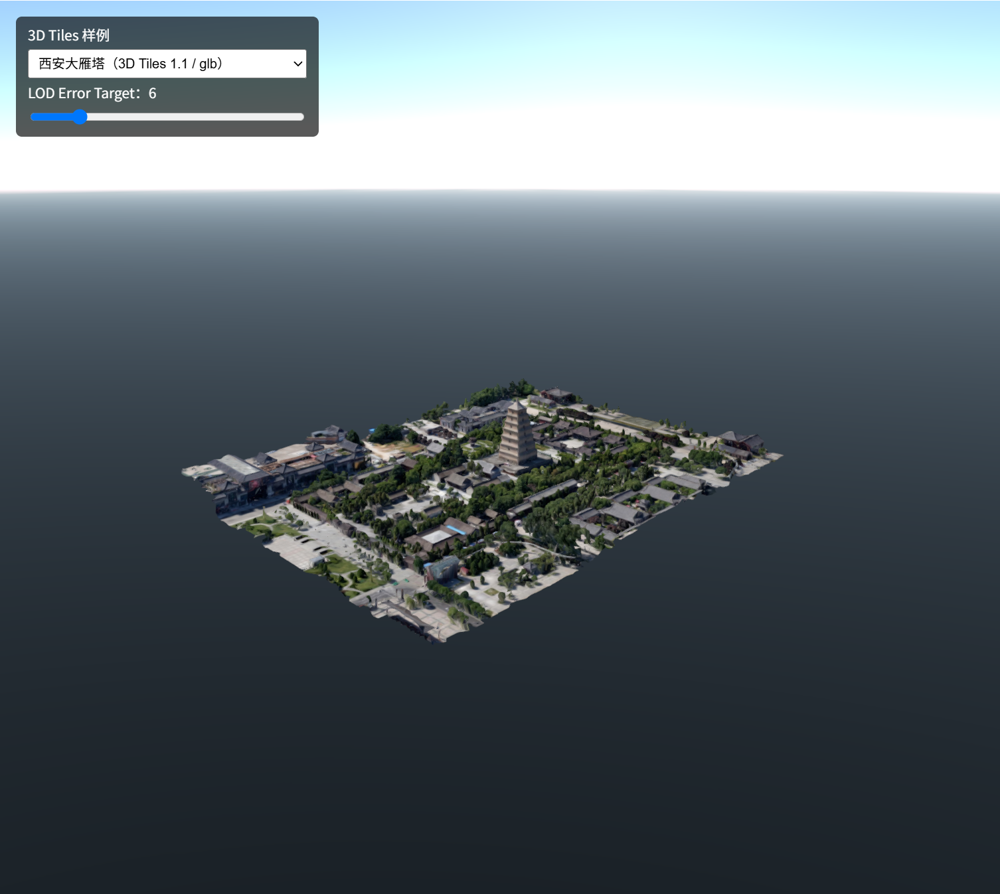

# Orillusion Geo

基于 [Orillusion](https://www.orillusion.com/) 与 WebGPU 的轻量级三维 GIS 库。

当前项目聚焦于将 [3d-tiles-renderer/core](https://github.com/NASA-AMMOS/3DTilesRendererJS) 的瓦片调度能力接入 Orillusion ECS 架构，为地理空间数据加载与后续 GIS 能力奠定基础。



## 当前成果

当前版本仅实现 **3D Tiles 加载**，包括：

- 基于 ECS `TilesRendererComponent` 的每帧瓦片更新。
- 3D Tiles 1.0（B3DM）与 1.1（GLB）数据加载。
- 屏幕空间误差（SSE）LOD 选择、网络请求与缓存调度。
- tileset 世界矩阵、Y-up/Z-up 坐标校正，以及与 LOD 包围体一致的空间计算。
- glTF 基础贴图的 sRGB 颜色处理与无光照材质显示。
- Orillusion 与 Three.js CDN 两套对照示例，可实时调整 `LOD Error Target`。

> 这是一个早期项目。目前不包含地形、影像、矢量图元、坐标转换服务或 Cesium API 兼容层。

## 快速开始

### 环境要求

- Node.js 20 或更高版本。
- 支持 WebGPU 的现代浏览器，例如 Chrome 或 Edge。

### 安装与运行

```bash
npm install
npm run dev
```

启动后可打开以下示例：

- `/`：示例导航入口。
- `/examples/orillusion_3dtilesrender.html`：Orillusion WebGPU 3D Tiles 示例。
- `/examples/threejs_3dtilesrender.html`：Three.js CDN 对照示例。

构建生产产物：

```bash
npm run build
```

## 项目结构

```text
src/
├─ Math/                 # 3D Tiles 包围体与空间计算
└─ Renderer/             # ECS 组件和 Orillusion 渲染适配器
examples/                # Orillusion 与 Three.js 对照示例
data/                    # 本地测试用 3D Tiles 数据与预览图
```

## 路线图

### 下一步：瓦片地形与影像

构建类 Cesium 的瓦片地形、影像图层系统，包括四叉树瓦片调度、地形高程、影像请求与图层叠加能力。

### 再下一步：GIS 图元

在地形与影像基础上加入 GIS 矢量图元，例如：

- 折线与路径；
- 贴地多边形；
- 后续的点、标注与交互拾取能力。

## 依赖

- [Orillusion](https://www.orillusion.com/)：WebGPU 渲染与 ECS 框架。
- [3d-tiles-renderer](https://github.com/NASA-AMMOS/3DTilesRendererJS)：3D Tiles 请求、缓存与 LOD 调度。

## 开发说明

项目采用 TypeScript。公共实现优先遵循 Orillusion 的 ECS 组织方式，核心类按空间计算与渲染适配职责分别放在 `src/Math` 和 `src/Renderer`。
